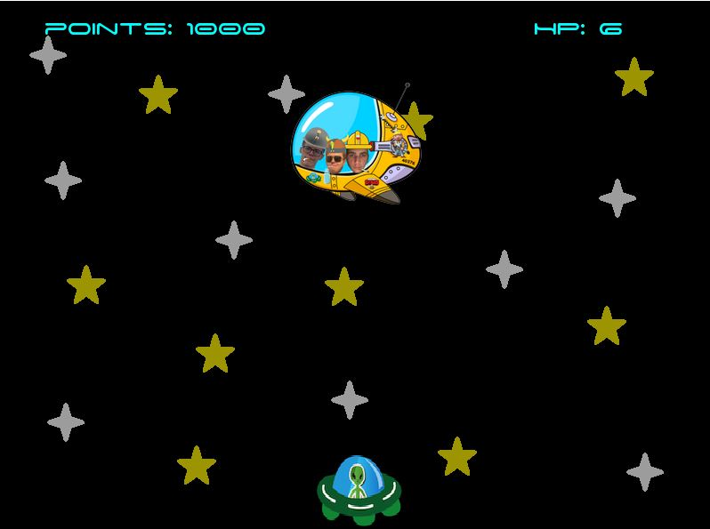

<h1 align="center">
    JurekSpejsInvejder
</h1>

## About
JurekSpejsInvejder C++ SFML Game made as final project for object oriented programming course at Poznan University of Technology.

## Preview 


## How to run?
1. Clone the repo
    ```sh
   git clone https://github.com/KKonefeld/JurekSpejsInvejder-C-SFML-Game.git
   ```
2. Navigate into Release
    ``` 
    cd JurekSpejsInvejder-C-SFML-Game/Release
    ```
3. Run
    ```
    JurekSpejsInvejder.exe
    ```
4. Or open ``` JurekSpejsInvejder.sln ``` in main folder

## How to play?
- &#8593;: moving up in menu
- &#8595;: moving down in menu
- Enter : choose option / save option
- Esc : going back
    ######  Ingame controls
    &#8592;, &#8594;: moving on sides
    Space : shooting
    Z : change weapon bomb/laser

## Game Basics

    
