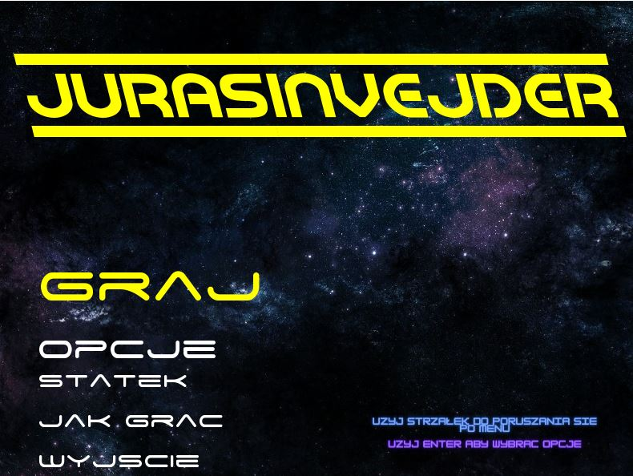
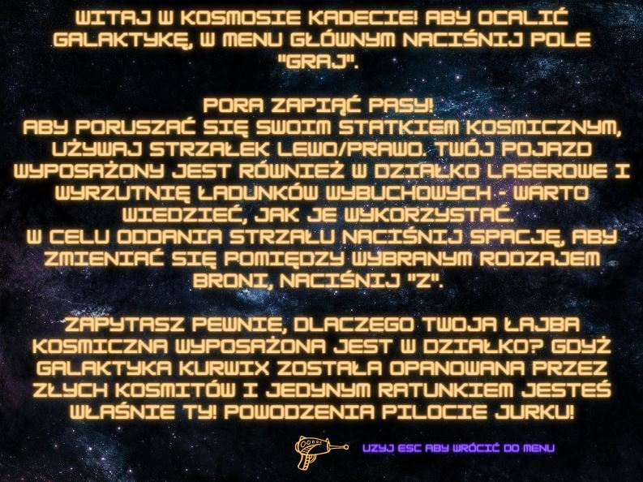
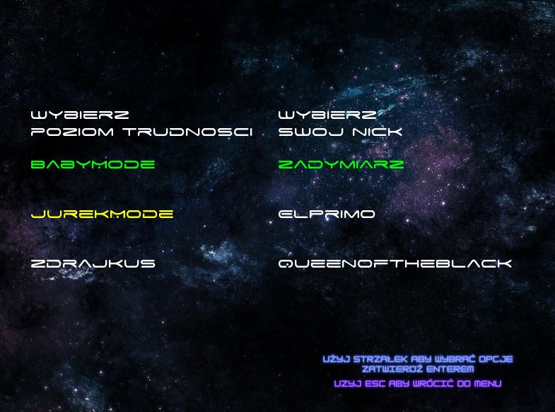
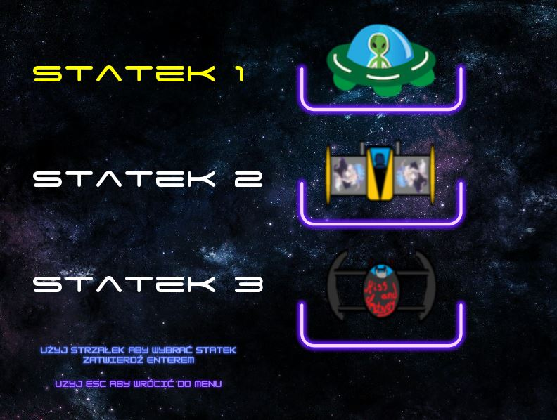
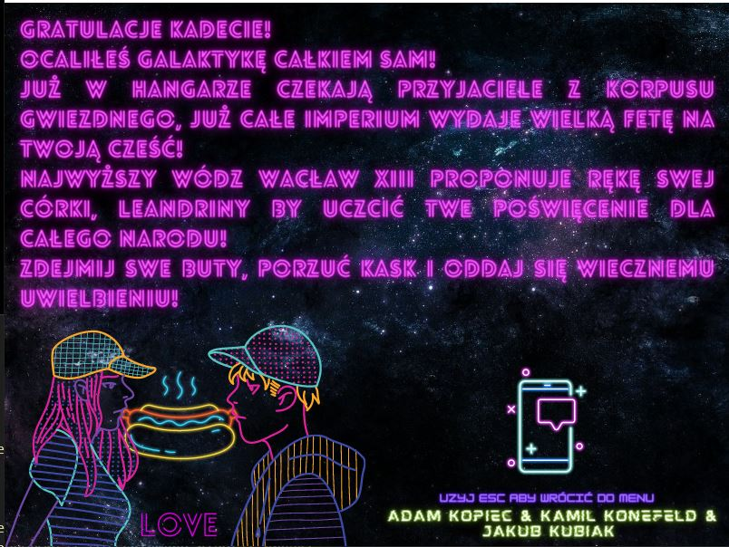
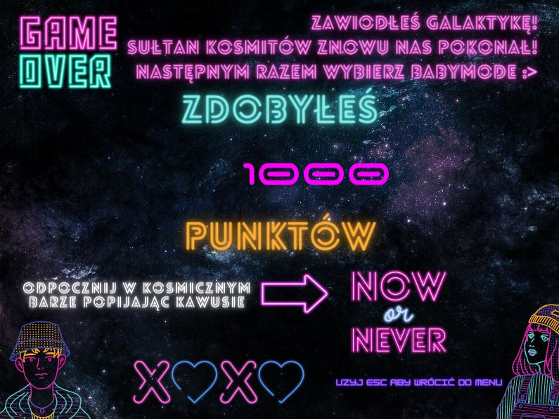

<h1 align="center">
    JurekSpejsInvejder
</h1>

## About
JurekSpejsInvejder C++ SFML Game made as final project for object oriented programming course at Poznan University of Technology.

## Preview 


## How to run?
1. Clone the repo
    ```sh
   git clone https://github.com/KKonefeld/JurekSpejsInvejder-C-SFML-Game.git
   ```
2. Navigate into Release
    ``` 
    cd JurekSpejsInvejder-C-SFML-Game/Release
    ```
3. Run
    ```
    JurekSpejsInvejder.exe
    ```
4. Or open ``` JurekSpejsInvejder.sln ``` in main folder

## How to play?
- &#8593;: moving up in menu
- &#8595;: moving down in menu
- Enter : choose option / save option
- Esc : going back
    ######  Ingame controls
    - &#8592;, &#8594;: moving on sides
    - Space : shooting
    - Z : change weapon bomb/laser

## Game Basics
- Boss appears after scoring 500 points, you can chagne it in JurekSpejsInvejder.cpp at line 126 ``` int bossThreshold = 500; ```
- You can choose between 3 ships, each unique abilities 
    1. Hp: 10 , LaserCD: 0.1s , BombCD: 1s;
    2. Hp: 20 , LaserCD: 0.3s , BombCD: 0.5s;
    3. Hp: 30 , LaserCD: 0.2s , BombCD: 2s;
    4. ``` You can change it in line 177-194 (JurekSpejsInvejder.cpp)  ```
- You can choose between 3 diff. levels
    1. EnemyShootCD: 1s , EnemySpawnCD: 10s , PointsToBoss: 500 , BossHP: 20, BossShootCD: 3s;
    2. EnemyShootCD: 0.5s , EnemySpawnCD: 5s , PointsToBoss: 1500 , BossHP: 100, BossShootCD: 1s;
    3. EnemyShootCD: 0.1s , EnemySpawnCD: 2s , PointsToBoss: 3000 , BossHP: 500, BossShootCD: 0s;
- Choosing Nick is not an option ( purely cosmetic ) Misses code and saving stats to file , line 264

 ## More Screens
 
 
 
 
 
 ## When you win
 
 
 ## When it's over 
 
